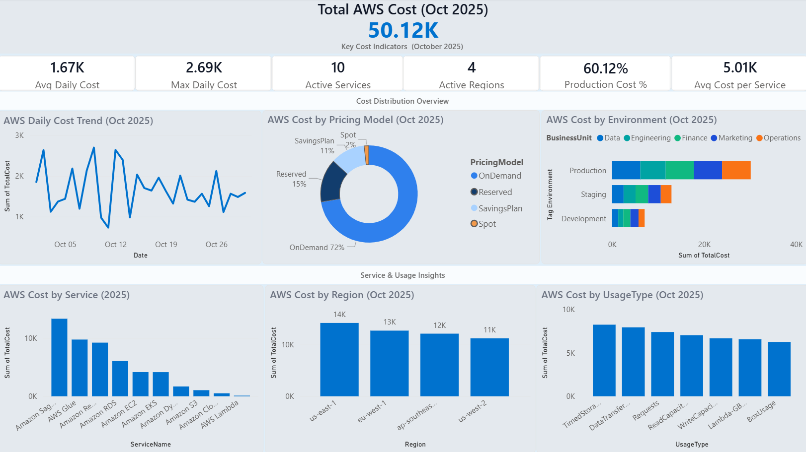

### *AWS Cloud Spend Intelligence – FinOps Analytics & Optimization Dashboard*

This project delivers a full-cycle FinOps analysis of AWS cloud spending for October 2025, built using Power BI and aligned with FinOps Foundation practices. It combines Spend Intelligence, cost optimization modeling, resource rightsizing analysis, tagging health, anomaly detection, and cost-efficiency insights into a multi-page analytics dashboard.

The solution includes custom DAX measures, KPI engineering, allocation logic, EC2 utilization scoring, and scenario-based savings models (e.g., Savings Plans vs On-Demand). The dashboard reveals cost drivers, highlights waste, and provides actionable recommendations for improving the financial sustainability of cloud workloads.


---

##  Project Overview

The FinOps dashboard uncovers:
- Total AWS spend across services, regions, pricing models, and usage types  
- High-cost drivers contributing to overall cloud cost  
- Rightsizing and Savings Plan optimization opportunities  
- Daily anomalies and unusual spend patterns  
- Estimated savings from switching On-Demand workloads to Savings Plans

The solution is structured across two analytical pages, each with a strategic purpose.

---

## **Page 1 - Executive Cost Summary**
**File:** `page1_summary.png`



### Key Features
- Total AWS Spend  
- Average & Maximum Daily Cost  
- Number of Active Services  
- Regions in Use  
- Production Cost %  
- Average Cost per Service  
- Daily Cost trend
- Spend by Pricing Model  
- Spend by Environment (Prod/Stage/Dev)  
- Top Services by Cost  
- Spend by Region  
- Spend by Usage Type
  
This page gives leadership a high-level understanding of cloud spend, drivers, and patterns.
---

## **Page 2 - Optimization Insights**
**File:** `page2_insights.png`


### Optimization KPIs
- **Estimated Savings (On-Demand → SP)**  
- Rightsizing %  
- Daily Cost Standard Deviation (StDev)  
- Optimization summary & Recommendations  

### Deep-Dive Visuals
- Cost Drivers by Service  
- Cost Drivers by Region  
- Cost by Usage Type  
- Daily Anomaly Detection   
- Spend by Tag: Environment  
- Spend by Pricing Model  

This page transforms raw billing data into actionable optimization strategies.
---

##  **Key DAX Measures Used**

```DAX
Total AWS Cost = SUM('aws_billing_daily_oct2025'[TotalCost])

Avg Daily Cost = 
AVERAGEX(
    VALUES('aws_billing_daily_oct2025'[Date]),
    CALCULATE(SUM('aws_billing_daily_oct2025'[TotalCost]))
)

Max Daily Cost = 
MAXX(
    VALUES('aws_billing_daily_oct2025'[Date]),
    CALCULATE(SUM('aws_billing_daily_oct2025'[TotalCost]))
)

Active Services = DISTINCTCOUNT('aws_billing_daily_oct2025'[ServiceName])

Regions Used = DISTINCTCOUNT('aws_billing_daily_oct2025'[Region])

Production Cost % =
DIVIDE(
    CALCULATE(SUM('aws_billing_daily_oct2025'[TotalCost]), 'aws_billing_daily_oct2025'[Tag_Environment] = "Production"),
    SUM('aws_billing_daily_oct2025'[TotalCost])
)

Avg Cost per Service =
DIVIDE([Total AWS Cost], [Active Services])

Estimated Savings (OnDemand_SP) =
[Total AWS Cost] * 0.30   -- Assuming 30% savings potential

Rightsizing % =
DIVIDE([Estimated Savings (OnDemand_SP)], [Total AWS Cost])

Daily Cost StdDev =
STDEVX.S(
    VALUES('aws_billing_daily_oct2025'[Date]),
    CALCULATE(SUM('aws_billing_daily_oct2025'[TotalCost]))
)
```
# Insights Summary (Business + Technical)
## 1.Cost Drivers

- Highest spend from AWS Glue, Redshift, RDS, and EC2
- Primary region: US-East-1
- Usage cost is dominated by TimedStorage-GB, DataTransfer-Out, Requests
- On-Demand pricing accounts for ~72% of total cost

## 2.Optimization Opportunities

- Converting On-Demand to Savings Plans yields ~30% savings
- Rightsizing analysis shows ~22% optimization potential
- Staging/Dev environments show non-critical over-provisioned workloads
- Data transfer inefficiencies create unnecessary cost spikes

## 3.Anomaly Detection

- Several daily spikes >2× above baseline

- Likely sources: ETL pipeline inefficiencies, temporary workloads, unplanned data transfer

## 4.Estimated Savings

~$10.9K/month in potential savings through:

~Savings Plans

~Rightsizing

~Eliminating waste in Staging/Dev

~Reducing data-transfer inefficiencies 

## Skills Demonstrated
- Developed multi-page Power BI dashboards with consistent UX and KPI design
- Engineered custom DAX measures (AVERAGEX, MAXX, DISTINCTCOUNT, STDEVX.S) for analytical insightss
- Applied FinOps principles such as rightsizing, cost visibility, and savings plan modeling
- Identified cost drivers, usage inefficiencies, and high-spend AWS services via BI analysis
- Built optimization recommendations aligned with cloud financial management practices
- Documented the entire BI and FinOps workflow following professional GitHub standards


